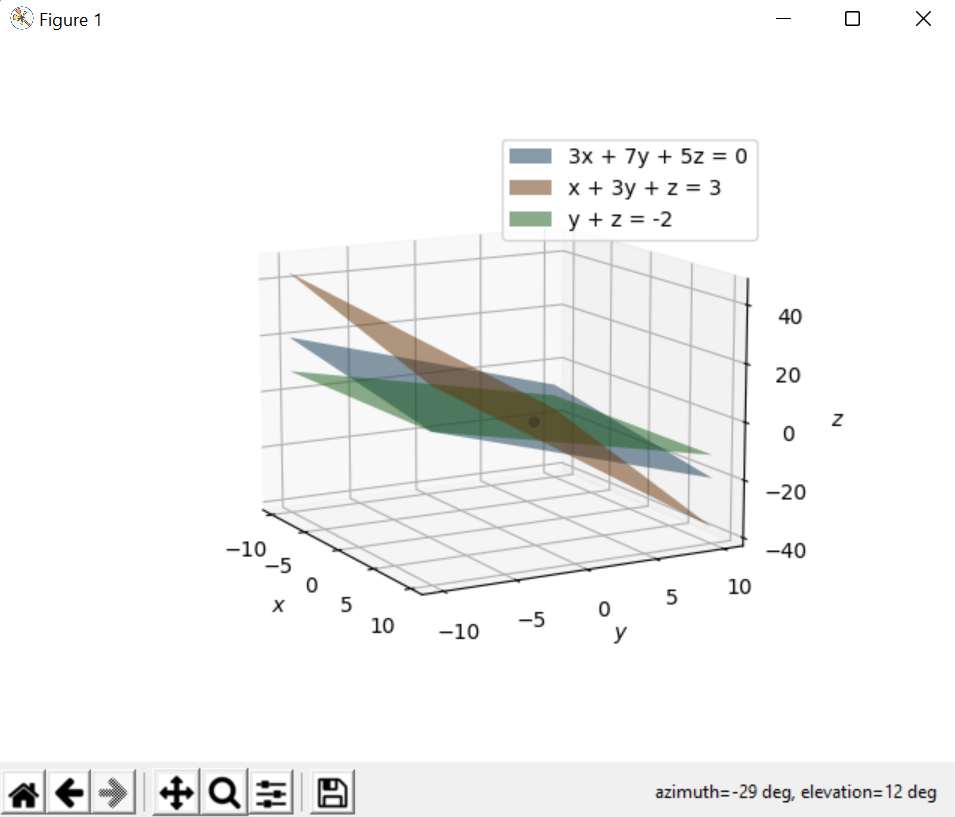

# System of equations solver
This program solves a system of **3 linear equations**, and tells if it's an Independent, Dependent or Inconsistent System. It also shows the planes of each equation in a 3D plot.

## Methods used
- Cramer's rule
- Rouché-Capelli theorem (a.k.a. Rouché-Frobenius)

## Example
```
Enter 3 vars (ex: xyz): xyz
Equation 1: 3x + 7y + 5z = 0
Equation 2: x + 3y + z = 3 
Equation 3: y + z = -2

System type: Independent System

The planes intersect in a point:
x = 2.5
y = 1.25
z = -3.25
```


## References
- Wikipedia  
    https://en.wikipedia.org/wiki/System_of_linear_equations  
    https://en.wikipedia.org/wiki/Cramer%27s_rule  
    https://en.wikipedia.org/wiki/Rouch%C3%A9%E2%80%93Capelli_theorem  
